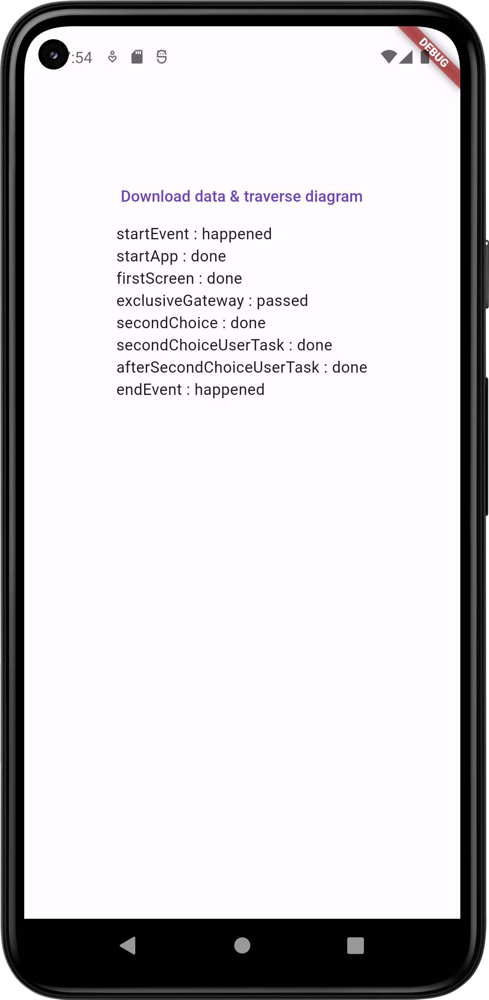

# bpmn_parse

Обход BPMN диаграммы

## Скриншоты

## Работа приложения

- получение списка элементов из JSON [lib/data/fetcher.dart](lib/data/fetcher.dart)
- создание диаграммы из полученного списка [lib/data/bpmn_diagram.dart](lib/data/bpmn_diagram.dart)
  - определение первого элемента
  - создание map для обращения к элементу диаграммы по индексу: ключ - индекс элемента, значение - сам элемент
  - создание map для обхода диаграммы: ключ - индекс элемента, значение - список индексов элементов, к которым можно перейти
- обход диаграммы - функция traverseDiagram() [lib/data/bpmn_diagram.dart](lib/data/bpmn_diagram.dart)
  - цикл, который продолжается, пока есть элементы, к которым можно перейти от текущего
  - если таких элементов больше одного, то показываются кнопки для выбора пользователем и происходит ожидание его ответа
  - текущий элемент классифицируется по иерархии классов (функция _classifyElement) и обрабатывается соответствующим его типу образом (функция _executeFlowObject)

## BPMN диаграмма

[lib/data/bpmn_diagram.dart](lib/data/bpmn_diagram.dart)
Диаграмма рассматривается как ориентированный граф, вершинами являются все элементы диаграммы (всех типов, даже flowSequence).
Она хранится как
- _startElementId - стартовое событие диаграммы
- Map _allElements - все элементы диаграммы (вершины графа)
  - ключ - индекс элемента
  - значение - сам элемент
- Map _allNodes - список смежности для этого графа
  - ключ - индекс элемента
  - значение - список индексов элементов, к которым можно перейти

## Иерархия классов элементов

Элементы диаграммы делятся на следующие классы (названия взяты из [wiki](https://en.wikipedia.org/wiki/Business_Process_Model_and_Notation#Flow_objects_and_connecting_objects)):
- FlowObject [lib/data/flow_objects/flow_object.dart](lib/data/flow_objects/flow_object.dart)
  - Activity [lib/data/flow_objects/activities/activity.dart](lib/data/flow_objects/activities/activity.dart)
    - ServiceTask [lib/data/flow_objects/activities/service_task.dart](lib/data/flow_objects/activities/service_task.dart)
    - UserTask [lib/data/flow_objects/activities/user_task.dart](lib/data/flow_objects/activities/user_task.dart)
  - Event [lib/data/flow_objects/events/event.dart](lib/data/flow_objects/events/event.dart)
    - StartEvent [lib/data/flow_objects/events/start_event.dart](lib/data/flow_objects/events/start_event.dart)
    - EndEvent [lib/data/flow_objects/events/end_event.dart](lib/data/flow_objects/events/end_event.dart)
  - Gateway [lib/data/flow_objects/events/gateway.dart](lib/data/flow_objects/events/gateway.dart)
    - ExclusiveGateway [lib/data/flow_objects/events/exclusive_gateway.dart](lib/data/flow_objects/events/exclusive_gateway.dart)