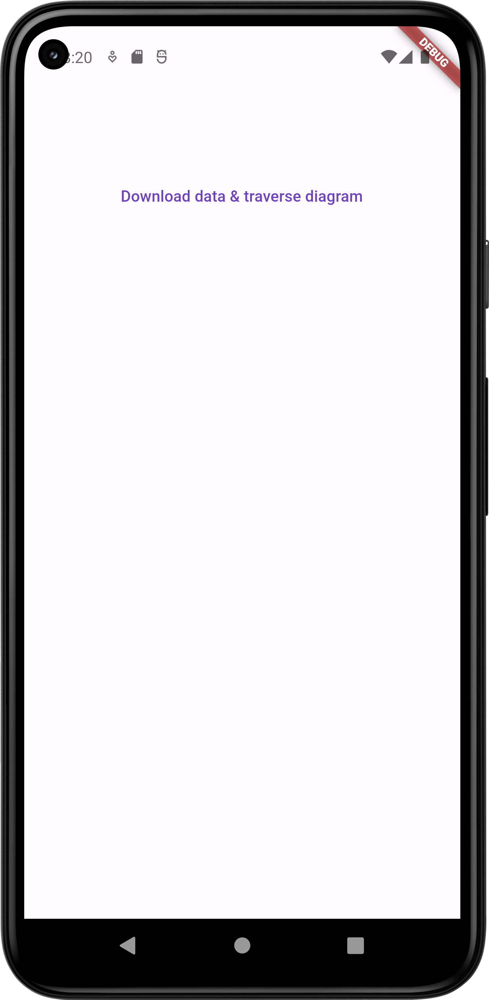
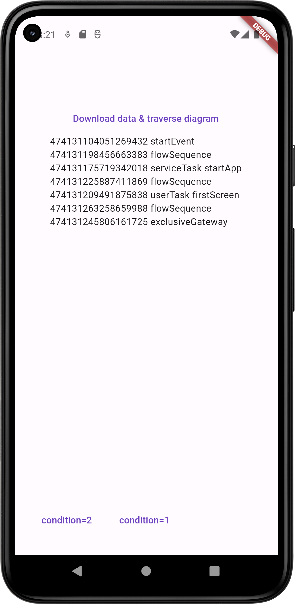
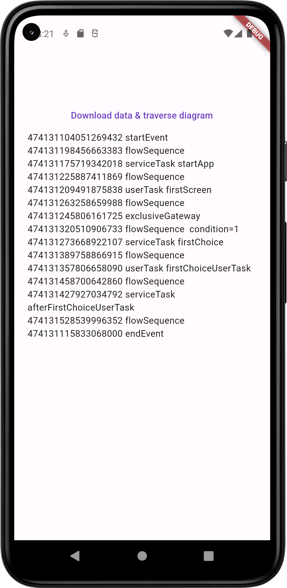

# bpmn_parse

Обход BPMN диаграммы

## Скриншоты

  

## Работа приложения

- получение списка элементов из JSON [lib/data/fetcher.dart](lib/data/fetcher.dart)
- создание диаграммы из полученного списка [lib/data/bpmn_diagram.dart](lib/data/bpmn_diagram.dart)
  - определение первого элемента
  - создание map для обращения к элементу диаграммы по индексу: ключ - индекс элемента, значение - сам элемент
  - создание map для обхода диаграммы: ключ - индекс элемента, значение - список индексов элементов, к которым можно перейти
- обход диаграммы - функция _traverseDiagram() [lib/ui/my_home_page.dart](lib/ui/my_home_page.dart)
  - цикл, который продолжается, пока есть элементы, к которым можно перейти от текущего
  - если таких элементов больше одного, то показываются кнопки для выбора пользователем и происходит ожидание его ответа

## BPMN диаграмма

[lib/data/bpmn_diagram.dart](lib/data/bpmn_diagram.dart)
Диаграмма рассматривается как ориентированный граф, вершинами являются все элементы диаграммы (всех типов, даже flowSequence).
Она хранится как
- _startElementId - стартовое событие диаграммы
- Map _allElements - все элементы диаграммы (вершины графа)
  - ключ - индекс элемента
  - значение - сам элемент
- Map _allNodes - список смежности для этого графа
  - ключ - индекс элемента
  - значение - список индексов элементов, к которым можно перейти